# daily-study
daily study for junior developer

## 알고리즘

### 프로그래머 코딩테스트 고득점 Kit

- [README](./algorithm/programmers-kit/README.md)

- 코딩테스트 실력 향상을 위해 프로그래머스 코딩테스트 고득점 Kit 문제 풀이

## ✏ 목표

### 22-11-23
- 프로그래머스 코딩테스트 고득점 Kit: 해시 - 완주하지 못한 선수(Lv1) 풀기 ([문제 링크](https://school.programmers.co.kr/learn/courses/30/lessons/42576))

### 22-11-24
- 프로그래머스 코딩테스트 고득점 Kit: DFS/BFS - 타겟 넘버(Lv2) 공부하기 ([문제 링크](https://school.programmers.co.kr/learn/courses/30/parts/12421))

## 프로젝트 연결하기

### git 명령어 이용해서 프로젝트 클론 받기

```bash
// 클론으로 프로젝트 받기
git clone https://github.com/for-junior-developer/daily-study.git

```

### 인텔리제이 File - Open으로 클론 받은 프로젝트 열기

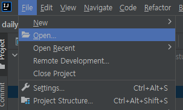

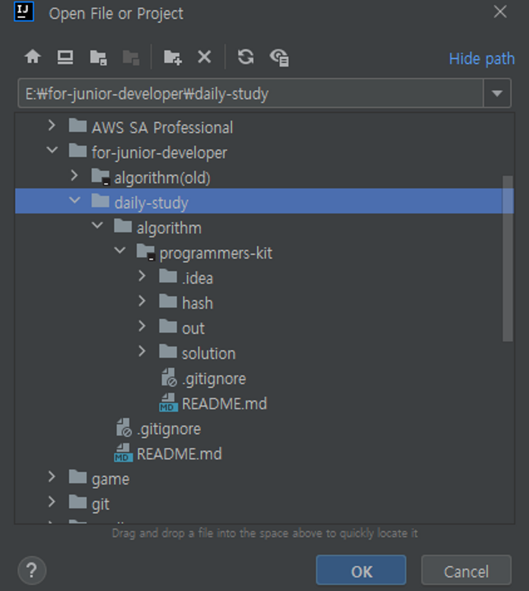


### 프로젝트 설정 들어가기

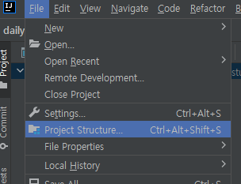

### 프로젝트 설정 - SDK와 Language level 설정하기

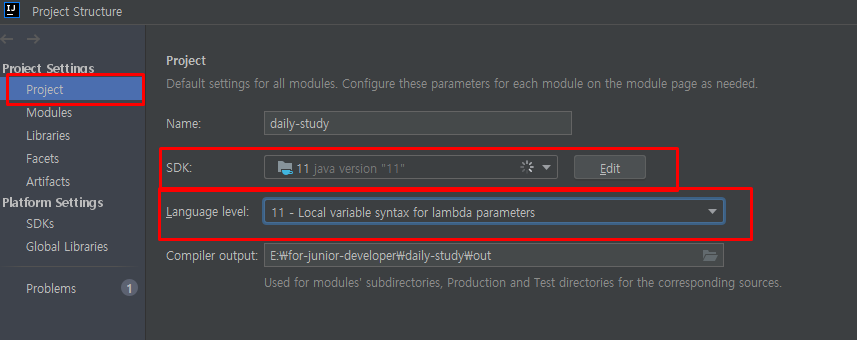

### 프로젝트 설정 - Modules에서 Sources 폴더 설정하기

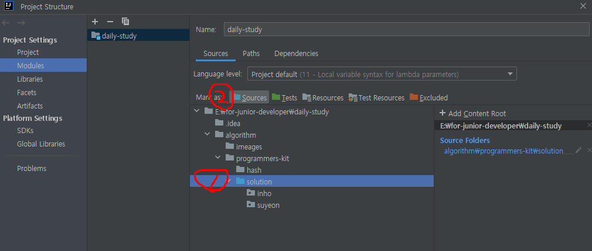

### java 파일 만들기

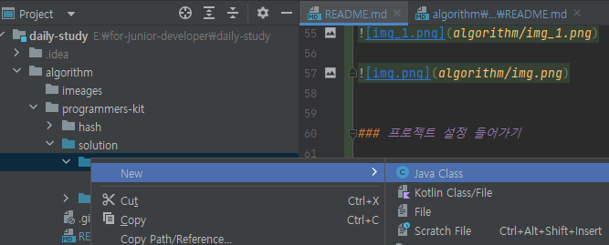

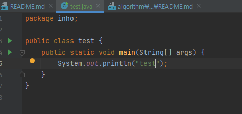

### 커밋하기

#### 아래 터미널 들어가기

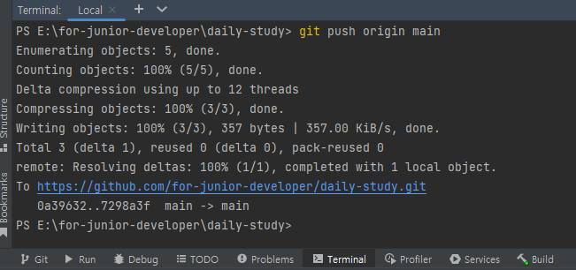

#### git add . 로 변경된 모든 파일 커밋할 파일로 추가하기 (또는 git add [경로를 포함한 추가할 파일명])

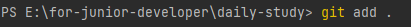

#### git status로 커밋할 파일 목록 확인하기

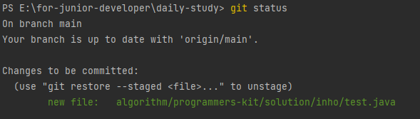

#### git commit -m "메세지" 로 커밋하기

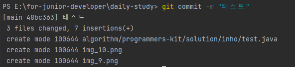

#### git push origin main으로 깃허브에 푸쉬하기

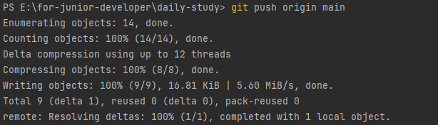

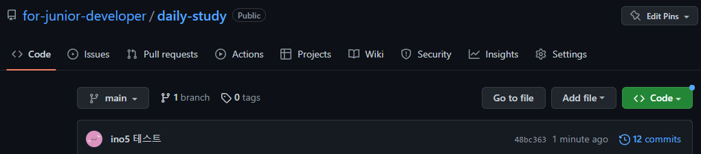


## 깃 기본 명령어 정리

``` bash
// 클론으로 프로젝트 받기
git clone https://github.com/for-junior-developer/daily-study.git

// 클론 받은 프로젝트 폴더로 이동
cd daily-study/

// github에서 커밋된 내용 가져오기
git pull origin main

// 깃 커밋할 파일 목록 확인
git status

// 변화된 파일 모두 커밋할 파일 목록에 올리기
git add . 

// 커밋하기
git commit -m "메세지"

// 커밋한 내용 github에 푸시하기
git push origin main

```