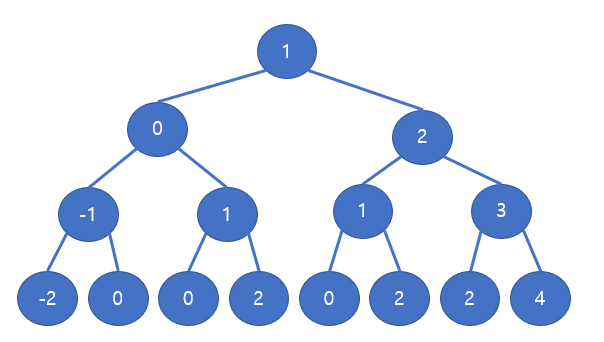

# 타겟 넘버

[문제 주소](https://school.programmers.co.kr/learn/courses/30/lessons/43165)


## DFS 방식으로 푼 풀이 방식 정리 - inho (작성중)

### 전체 코드

```java
package inho;

import java.util.*;

// https://school.programmers.co.kr/learn/courses/30/lessons/43165
public class 타겟_넘버 {
    static class Solution {
        static int[] g_numbers;
        static int g_target, g_answer;
        static Stack<int[]> g_stack = new Stack<>();
        static int[] g_sign = new int[] {-1, 1};
        static boolean[][] g_isVisited;
        public int solution(int[] numbers, int target) {
            g_numbers = numbers;
            g_target = target;

            // 가능한 시작지점마다 dfs 수행
            for (int i_starting = 0; i_starting < g_sign.length; i_starting++) {
                // 초기화
                g_isVisited = new boolean[numbers.length][g_sign.length];

                // 시작지점 방문하기
                visit(0, i_starting, 0);

                // dfs
                dfs();
            }

            int answer = g_answer;
            return answer;
        }

        // 방문하기
        public void visit(int depth, int i_sign, int curSum) {
            // 방문 처리
            g_isVisited[depth][i_sign] = true;

            // 새로운 합 계산
            int newSum = curSum + g_sign[i_sign] * g_numbers[depth];

            // 스택에 넣기
            g_stack.push(new int[] {depth, newSum});
        }

        // dfs
        public void dfs() {
            if (g_stack.size() == 0) {
                return;
            }

            int[] poppedArr = g_stack.pop();
            int depth = poppedArr[0] + 1;
            int curSum = poppedArr[1];

            if (depth == g_numbers.length) {
                if (curSum == g_target) {
                    g_answer++;
                }
                return;
            }

            for (int i = 0; i < g_sign.length; i++) {
                visit(depth, i, curSum);
                dfs();
            }
        }
    }
}

```

### 아이디어



- 노드마다 이웃이 2개 있다.
- 이웃은 방문 기준 노드의 값은 보다 1이 작은 값이거나 1이 큰 값이다.